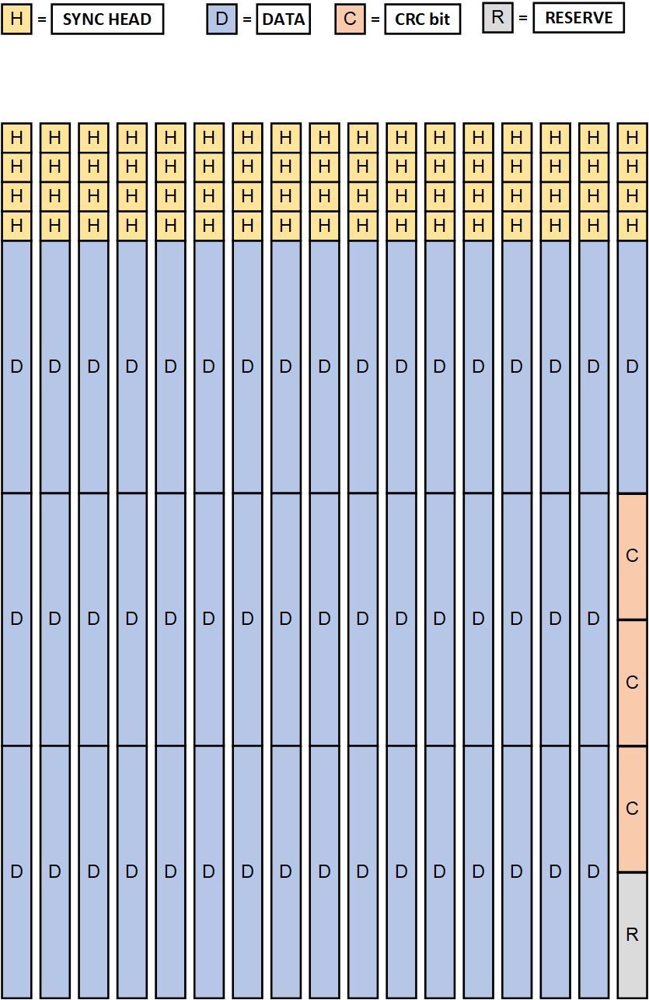

# 60路并行CRC-10校验

## CRC-10标准生成多项式

$G(x) = x^{10} + x^9 + x^5 + x^4 + x^1 + 1$

## 数据包结构

1个数据包由`17`帧数据组成，1帧数据有`64bit`，每一帧的`[63:60]`为同步头(Sync Head)。第`1-16`帧`[59:0]`均为有效数据，而第`17`帧的`[59:0]`由三种不同的数据填充，其中`[59:40]`为有效数据，`[39:30]`、`[29:20]`、`[19:10]`分别为CRC校验结果，`[9:0]`为保留位，暂时没有决定填充什么数据

## 校验方式

在数据包的前16帧中，将除同步头之外的60bit分为三组。

- 第一组为每一帧的`[59:40]`位，包含`17`帧，一共`340bit`
- 第二组位每一帧的`[39:20]`位，包含`16`帧，一共`320bit`
- 第三组为每一帧的`[19:0]`位，包含`16`帧，一共`320bit`

三组数据分别进行CRC-10校验，第一组数据校验结果放在第`17`帧的`[39:30]`位，第二组数据校验结果放在第`17`帧的`[29:20]`位，第三组数据校验结果放在第`17`帧的`[19:10]`位
